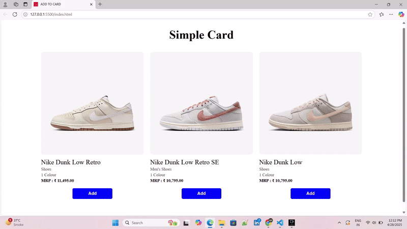

<h1>🦠 COVID-19 Tracker App</h1>
A real-time COVID-19 Tracker App built using HTML, CSS, JavaScript, and a live Coronavirus API.
Stay updated with the latest case numbers, recoveries, and deaths from around the world or specific countries.

🚀 Features
Fetch real-time COVID-19 data from a public API

Global statistics: Total Cases, Recoveries, Deaths

Country-specific search and data display

Clean, responsive, and mobile-friendly UI

Error handling for invalid country names

Smooth loading animations and dynamic updates

🎥 Demo

🛠️ Tech Stack

--> HTML5 — Page structure

--> CSS3 — Styling and layout

--> JavaScript (Vanilla) — API fetching and dynamic DOM updates

<h1>🛒 Add to Cart</h1>

🛒 Add to Cart App A simple and dynamic Add to Cart functionality built using HTML, CSS, and JavaScript. Users can browse products, add them to their cart, update quantities, and remove items — a great starting point for building full e-commerce websites!

🚀 Features Display a list of products dynamically

Add products to the shopping cart

Increase or decrease product quantity

Remove items from the cart

View total price and total item count

Fully responsive and mobile-friendly layout

Smooth animations and clean design

🎥 Demo

#Drive video link

watch video = "https://drive.google.com/drive/folders/1irzpIB5zYVmjnwusD0YgPkGzw6hJd8YE?usp=sharing"

🛠️ Tech Stack

--> HTML5 — Structure

--> CSS3 — Styling and responsiveness

--> JavaScript (Vanilla) — Cart logic and dynamic interactivity
