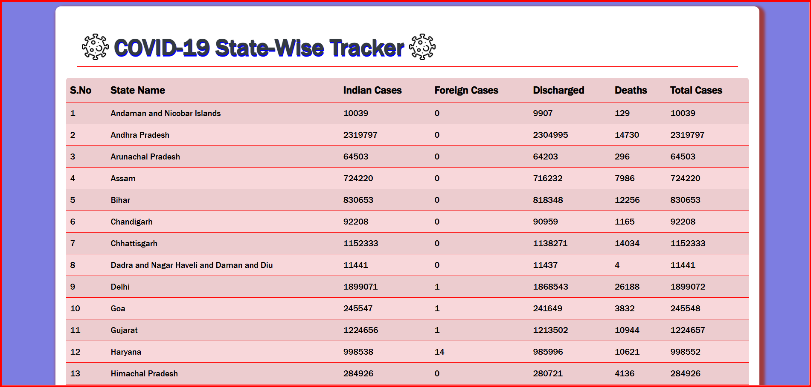

🦠 COVID-19 State-wise Tracker using API

ⓘ This project is a simple and responsive web application that fetches real-time COVID-19 data from a public API and displays state-wise statistics for India. It helps users stay informed about the number of confirmed cases, recoveries, active cases, and deaths in each state. The app updates data dynamically and presents it in a clean, easy-to-read format.

✅ Key Features:

👉 Live COVID-19 data fetched using API

👉 State-wise breakdown of statistics

👉 Responsive and user-friendly UI

📺 Demo Video

🖼️ Screenshot

